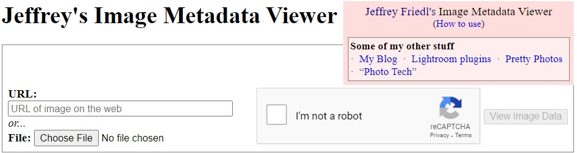

<h3>How to track anyone currect Location with the use of Image metadata </h3> 

<b>warnning</b>:
 

This post is being given by us only for the purpose of cyber security education to you, if you use it for any illegal work, only you are responsible for it.
 

<h6> Say Hello For Happy Knowledge </h6> 

So let's start. How hackers use a simple looking photo to find out some of your most personal information, including your recent location. Before knowing how they find out your information from the image, it will also be very important for you to know what kind of data is stored inside an image when you take a photo of a place, object or yourself from your smartphone or camera. take. Behind a simple-looking photo, your device becomes a kind of data that we call "metadata". Meta data is stored by your device as the main data of your image in your image file which is usually not visible because it is saved in your image in a binary language. You have to take the help of a capable tool or a web script to view this data. I want to share this one web script based site with you.
 
<h4> Translated (hindi)</h4> 

चलिए, शुरू करते हैं। हैकर्स आपके हाल के स्थान सहित आपकी कुछ सबसे व्यक्तिगत जानकारी का पता लगाने के लिए एक साधारण दिखने वाली तस्वीर का उपयोग कैसे करते हैं। यह जानने से पहले कि वे छवि से आपकी जानकारी का पता कैसे लगाते हैं, आपके लिए यह जानना भी बहुत महत्वपूर्ण होगा कि जब आप अपने स्मार्टफोन या कैमरे से किसी स्थान, वस्तु या स्वयं की तस्वीर लेते हैं तो किसी छवि के अंदर किस प्रकार का डेटा संग्रहीत होता है। लेना। एक साधारण दिखने वाली तस्वीर के पीछे, आपका डिवाइस एक तरह का डेटा बन जाता है जिसे हम "मेटाडेटा" कहते हैं। मेटा डेटा आपके डिवाइस द्वारा आपकी छवि फ़ाइल में आपकी छवि के मुख्य डेटा के रूप में संग्रहीत किया जाता है जो आमतौर पर दिखाई नहीं देता है क्योंकि यह आपकी छवि में बाइनरी भाषा में सहेजा जाता है। इस डेटा को देखने के लिए आपको किसी सक्षम टूल या वेब स्क्रिप्ट की मदद लेनी होगी। मैं यह एक वेब स्क्रिप्ट आधारित साइट आपके साथ साझा करना चाहता हूं।
 

<a href="http://exif.regex.info/exif.cgi">meta-data</a><h4> 👆 Web site is here 👆</h4>
<h4> Follow this step's for track location </h4> 

 step 1: take image with our victin phone with the use of any Social engineering trick.
 

 step 2:Then open your computer browser I recommend chrome for this process because it will work best in this case.
 

 step 3:click on my given like below in this post.

 

step 4: when you are gone this link it's tell you to upload a you image file on there site click to upload file and take I'm not a robot!
 

 step 5: this site show you many types of data in her results
 
  

 It will show some type's of data like image Aperture,location add ISO, filename and much more about your image in this case of your meta data who exist in your image file you are uploaded. 

### Give me Credit for this post

<h5> follow me on </h5>
 <a href="http://www.instagram.com/rockyjaat111_">Instagram</a> 
 <a href="http://www.instagram.com/gitttols"> Community</a> 
 <a href="https://gittools.blogspot.com"> official Site </a>

 <h6><b> This Content © Copyright by Team Rocky | 2021 </h6>
